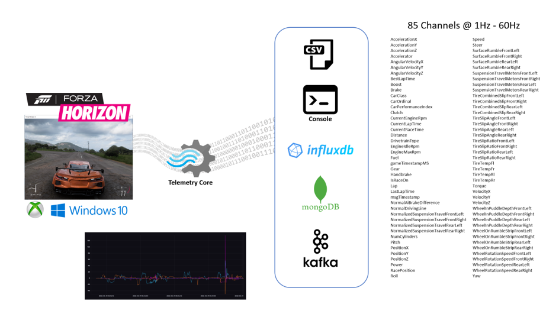

# Telemetry Core


░▀█▀░█▀▀░█░░░█▀▀░█▄█░█▀▀░▀█▀░█▀▄░█░█░░░█▀▀░█▀█░█▀▄░█▀▀
░░█░░█▀▀░█░░░█▀▀░█░█░█▀▀░░█░░█▀▄░░█░░░░█░░░█░█░█▀▄░█▀▀
░░▀░░▀▀▀░▀▀▀░▀▀▀░▀░▀░▀▀▀░░▀░░▀░▀░░▀░░░░▀▀▀░▀▀▀░▀░▀░▀▀▀



## About

Core telemetry tool that processes Forza 5 game telemetry data and streams it out to

- Console
- CSV File
- MongoDB (Timeseries Collection)
- InfluxDB
- Kafka

## Usage
The application is a console app and responds to the follow key commands

- Press `S` to stop
- Press `Q` to display current recorder states
- Press `C` to toggle Console Output
- Press `M` to toggle Mongo Output
- Press `I` to toggle Influx Output
- Press `K` to toggle Kafka Output

## Configuration

Application can be configured by editing the `config.yaml` file prior to execution

```yaml
# Configuration Data
sampleRate: 50  #Hz

enableKafkaStreaming: false
enableMongoStreaming: false
enableInfluxStreaming: false

gameDataPort: 5300

# mongo Settings
mongouri: mongodb://localhost:27017
database: telemetry
collection: gamedata

# Influx Settings
influxHost: http://localhost:8086
token: <influx access token goes here>
bucket: telemetry
org: ctl

# Kafka Settings
kafkaServer: 172.23.139.89:9092
topic: telemetry

verbose: false
```

## References

Forza Core service from [forza-telemetry](https://github.com/austinbaccus/forza-telemetry) was used as a baseline design.